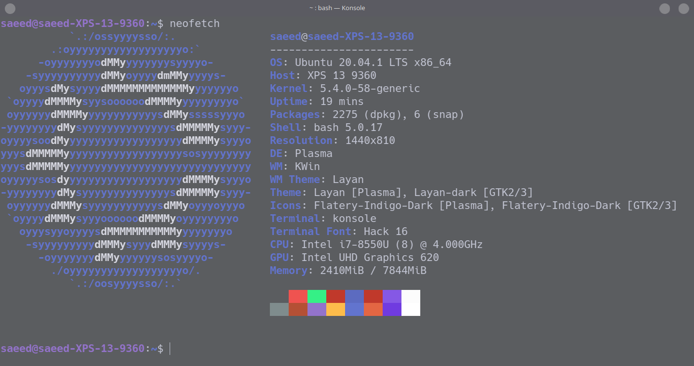
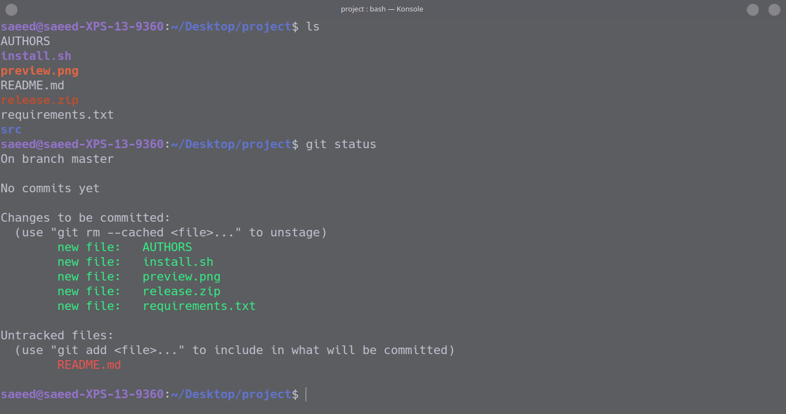

# Mystic
A Konsole colorscheme, based on the [Fluent konsole theme](https://store.kde.org/p/1305909/).

  

  
    Aurorae Decoarations: <a href="https://store.kde.org/p/1325238">Layan</a>
  

Example of what the colorscheme looks like in action:

  

## Installation
1. Download the [latest release](https://github.com/SaeedBaig/mystic-konsole/releases/).
2. Move the `Mystic.colorscheme` file to `~/.local/share/konsole/`
